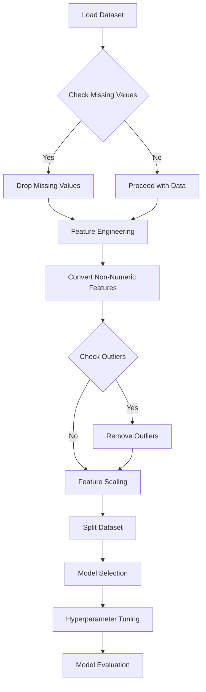

# 🏡 Real Estate Price Prediction Model


---

## 📄 Project Description
This project builds a state-of-the-art machine learning model for predicting real estate prices. It leverages advanced data preprocessing, feature engineering, and visualization techniques to optimize for accuracy and interpretability.

---

## ✨ Features
- **Data Analysis and Visualization**:
  - Scatter plots for price trends by property size, with regression lines and median annotations.
  - Enhanced data visualization with `Seaborn` and `Matplotlib` for outlier detection and regional trend analysis.
- **Comprehensive Data Cleaning**:
  - Cleans and preprocesses the dataset, including handling missing values, redundant columns, and outliers.
- **Feature Engineering**:
  - Adds computed metrics like `price_per_sqft` for standardized comparisons.
  - Clusters less frequent locations into broader categories for generalization.
- **Interactive Dashboard**:
  - Interactive visualizations with `Plotly` and a `Streamlit` dashboard for dynamic exploration.

---

## 🛠️ Data Preprocessing
1. **Loading the Dataset**: Uses `pandas` to load and inspect the dataset.
2. **Cleaning**: Drops redundant columns (like `area_type`, `society`, etc.) and handles missing values.
3. **Feature Engineering**:
   - Converts the `total_sqft` feature to a numeric format.
   - Adds `price_per_sqft` as a calculated metric.
4. **Outlier Removal**:
   - Filters out extreme outliers using IQR and z-score methods for improved model performance.

---

## 📈 Modeling
### Advanced Techniques
1. **Algorithms Used**:
   - Linear Regression,Lasso, Decision Trees,GridSearchCV and Random Forest Regressors.
2. **Cross-Validation and Evaluation**:
   - Uses `cross_val_score` for model evaluation and selects the best-performing algorithms.
   
---

## 📋 Requirements
To run this project, you need the following libraries:
- Python 3.9+
- Pandas 1.3+
- NumPy 1.21+
- Scikit-learn 0.24+
- Matplotlib 3.4+
- Seaborn 0.11+
- Plotly 5.0+ (for interactive plots)
- Streamlit (for dashboard)

Install dependencies using:
```bash
pip install -r requirements.txt
```

---

## 🚀 Usage
1. Clone the repository:
   ```bash
   git clone https://github.com/your-repo/real-estate-price-prediction.git
2. Navigate to the project directory:
   ```bash
   cd real-estate-price-prediction
   ```
3. Run the main analysis script:
   ```bash
   python main.py
   ```
4. (Optional) Start the interactive dashboard:
   ```bash
   streamlit run dashboard.py
   ```

---



---

## 📊 Interactive Visualizations
### Plotly and Streamlit Dashboard
This project includes a `Streamlit` dashboard for interactive visualizations:
1. **Geospatial Heatmap**: View price distributions by neighborhood.
2. **Price Distribution**: Histograms and density plots showing the spread of prices.
3. **Filterable Dashboard**: Adjust location, price range, and property size filters to gain insights.

---

## 🚧 Future Work
- Integrate **Deep Learning** models for higher accuracy on complex datasets.
- Enable real-time data updates for continuous model improvement.
- Expand dashboard features to include predictive insights based on user-defined criteria.

---

## 📝 License
This project is licensed under the MIT License. See the [LICENSE](LICENSE) file for more information.

