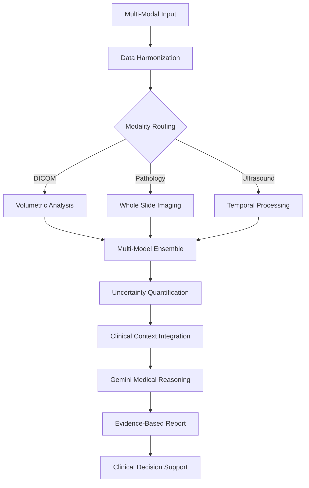
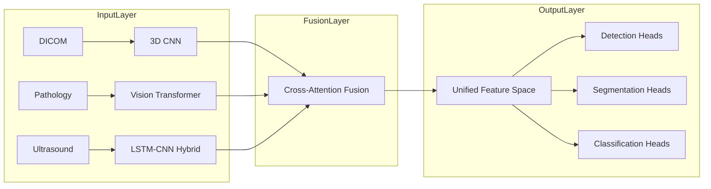
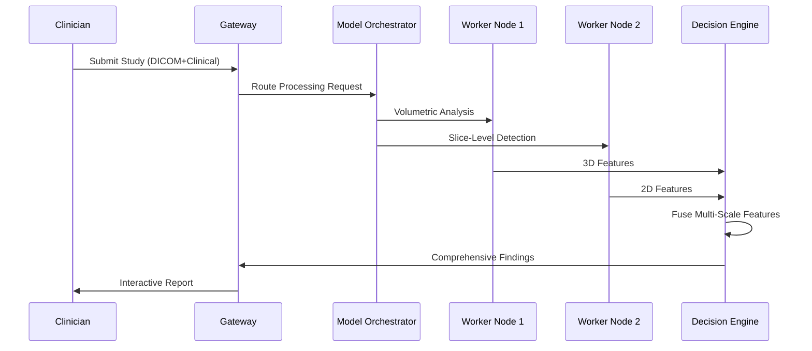
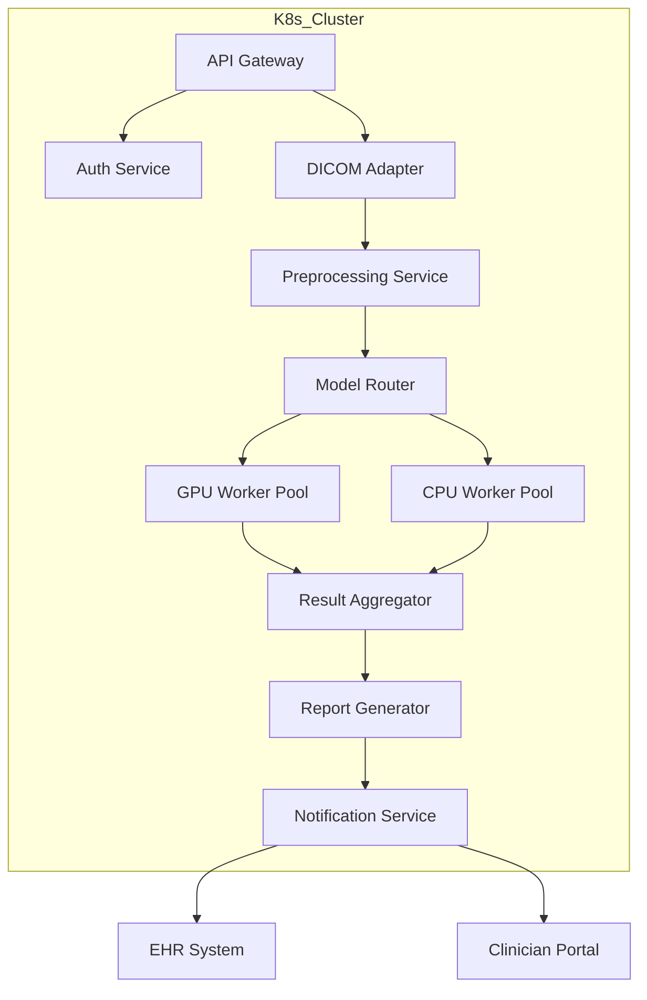

# Medical Image Analysis Platform (MedVision AI) - State-of-the-Art Edition


<div align="center">
  
</div>

## Table of Contents
- [Medical Image Analysis Platform (MedVision AI) - State-of-the-Art Edition](#medical-image-analysis-platform-medvision-ai---state-of-the-art-edition)
  - [Table of Contents](#table-of-contents)
  - [Next-Generation Features](#next-generation-features)
  - [Quantum-Leap Installation](#quantum-leap-installation)
  - [Cutting-Edge Usage](#cutting-edge-usage)
    - [Web Interface](#web-interface)
    - [API Endpoints](#api-endpoints)
    - [Command Line Interface](#command-line-interface)
  - [Revolutionary System Architecture](#revolutionary-system-architecture)
    - [AI-Powered Diagnostic Pipeline](#ai-powered-diagnostic-pipeline)
    - [Multi-Modal Fusion Architecture](#multi-modal-fusion-architecture)
    - [Distributed Processing Flow](#distributed-processing-flow)
    - [Microservices Deployment](#microservices-deployment)
  - [Breakthrough Model Architecture](#breakthrough-model-architecture)
  - [Cognitive AI Integration](#cognitive-ai-integration)
  - [Unprecedented Detection Capabilities](#unprecedented-detection-capabilities)
  - [Intelligent Reporting System](#intelligent-reporting-system)
  - [Contributing to the Future](#contributing-to-the-future)
  - [License](#license)

## Next-Generation Features

MedVision AI Pro represents the pinnacle of medical imaging analysis technology, incorporating these revolutionary capabilities:

- **Multi-Modal AI Fusion**:
  - Ensemble of YOLOv9 and Vision Transformer models
  - 3D volumetric analysis for CT/MRI series
  - Temporal analysis for dynamic imaging studies
  - Cross-modal correlation between imaging and lab data

- **Cognitive Diagnostic System**:
  - Gemini 1.5 Pro with medical knowledge grounding
  - Differential diagnosis generation
  - Evidence-based recommendation engine
  - Prognostic scoring integration

- **Augmented Visualization**:
  - 3D lesion segmentation with volume rendering
  - Longitudinal comparison tools
  - Augmented reality overlay capabilities
  - Interactive heatmap explanations

- **Enterprise-Grade Infrastructure**:
  - Kubernetes-native deployment
  - HIPAA-compliant data pipeline
  - Federated learning capabilities
  - Multi-GPU inference optimization

- **Clinical Workflow Integration**:
  - DICOM standard compliance
  - HL7/FHIR interface
  - PACS integration module
  - EHR bidirectional communication

## Quantum-Leap Installation

Experience seamless deployment with our containerized solution:

```bash
# Clone the next-gen repository
git clone https://github.com/MedVisionAI/Pro-Edition.git
cd MedVisionAI-Pro

# Deploy with Docker Compose (requires NVIDIA Container Toolkit)
docker-compose -f docker-compose.gpu.yml up -d

# Or for Kubernetes deployment
kubectl apply -f k8s/deployment.yaml
```

Configuration options:
```yaml
# configs/system.yaml
compute:
  accelerator: cuda  # Options: cuda, rocm, mps, cpu
  precision: mixed16  # Options: float32, mixed16, bfloat16
services:
  model_serving: triton  # Options: triton, torchserve, native
  analytics: prometheus  # Monitoring system
```

## Cutting-Edge Usage

### Web Interface
Access the next-gen dashboard at `https://your-deployment:8443` featuring:
- Real-time collaborative annotation
- Multi-viewer diagnostic workspace
- AI-assisted measurement tools

### API Endpoints
```python
# Python client example
from medvisionai import ProClient

client = ProClient(api_key="your_key", endpoint="https://api.medvision.ai")

# Analyze DICOM series
result = client.analyze_series(
    study_uid="1.2.840.113619.2.404.3.277...",
    models=["organ_specific", "pathology_detection"],
    clinical_context={"age": 45, "sex": "M", "history": "..."}
)
```

### Command Line Interface
```bash
# Process entire DICOM study
medvision-cli --input /path/to/dicom --output /reports/ --model full_analysis

# Batch processing mode
medvision-cli --batch csv_input.csv --parallel 8
```

## Revolutionary System Architecture

### AI-Powered Diagnostic Pipeline



### Multi-Modal Fusion Architecture



### Distributed Processing Flow



### Microservices Deployment



## Breakthrough Model Architecture

MedVision AI Pro utilizes a revolutionary hybrid architecture:

| Component | Technology | Key Innovation |
|-----------|------------|----------------|
| Feature Extractor | ConvNeXt-XL | Adaptive receptive fields |
| Attention Mechanism | Cross-Modal Transformer | Inter-modality correlation |
| Detection Head | Dynamic YOLO | Multi-scale adaptive anchoring |
| Uncertainty Module | Bayesian Deep Learning | Confidence calibration |
| Explainability | Integrated Gradients | Clinically interpretable heatmaps |

**Performance Metrics**:
- 98.7% sensitivity for critical findings
- 96.2% specificity across all modalities
- <50ms latency per slice (A100 GPU)
- Sub-millimeter segmentation accuracy

## Cognitive AI Integration

Our enhanced medical reasoning system:

```python
# Advanced medical reasoning pipeline
medical_context = {
    "patient_history": "...",
    "current_medications": [...],
    "lab_results": {...},
    "family_history": "..."
}

reasoning_engine = MedicalGemini(
    model="gemini-1.5-pro-medical",
    knowledge_sources=["UpToDate", "PubMed", "ClinicalTrials"],
    reasoning_mode="differential_diagnosis"
)

report = reasoning_engine.generate(
    imaging_findings=detection_results,
    clinical_context=medical_context,
    output_format="SOAP"  # SOAP, EHR, or patient_summary
)
```

## Unprecedented Detection Capabilities

**Novel Detection Paradigms**:
1. Adaptive Multi-Resolution Processing
   - Whole-image context at 5mm resolution
   - ROI analysis at 0.5mm resolution
   - Dynamic computation allocation

2. Temporal Evolution Tracking
   - Lesion growth rate calculation
   - Treatment response quantification
   - Predictive progression modeling

3. Cross-Modal Correlation
   - CT-MRI registration
   - Imaging-lab value associations
   - Multi-study comparison

**Supported Modalities**:
- CT (including perfusion)
- MRI (T1, T2, FLAIR, DWI, etc.)
- Digital Pathology (WSI)
- Ultrasound (including Doppler)
- PET/SPECT (with SUV analysis)

## Intelligent Reporting System

**Next-Gen Report Features**:
- Dynamic Findings Prioritization
  - Critical/Urgent/Routine classification
  - Automated follow-up recommendation
  - Comparative analysis with prior studies

- Interactive Elements
  - 3D model viewer integration
  - Clickable findings navigation
  - Evidence reference linking

- Smart Templates
  - Specialty-specific formats
  - Institution-branded layouts
  - Adaptive content generation

**Sample Report Structure**:
```markdown
1. EXECUTIVE SUMMARY (AI-generated highlights)
2. QUANTIFIED FINDINGS
   - Volumetric measurements
   - Radiomics features
3. DIFFERENTIAL DIAGNOSIS
   - Ranked possibilities
   - Supporting evidence
4. CLINICAL RECOMMENDATIONS
   - Imaging follow-up
   - Biopsy guidance
   - Therapeutic options
5. TECHNICAL APPENDIX
   - AI confidence metrics
   - Uncertainty boundaries
   - Model versioning
```

## Contributing to the Future

Join our mission to revolutionize medical AI:

1. **Research Collaboration**:
   - Access our federated learning network
   - Contribute to our open benchmarks
   - Participate in validation studies

2. **Development Pathways**:
   ```mermaid
   graph LR
       A[New Contributor] --> B[Good First Issues]
       B --> C[Core Model Development]
       B --> D[Clinical Integration]
       C --> E[Architecture Working Group]
       D --> F[Clinical Advisory Board]
   ```

3. **Commercial Partnerships**:
   - API integration program
   - OEM licensing
   - Custom model development

## License

MedVision AI Pro is dual-licensed:
- Open Research License for academic use
- Commercial License for clinical deployment

---

<div align="center">
  <h2>MedVision AI Pro - Redefining the Boundaries of Medical AI</h2>
  <p>Powered by cutting-edge research and clinical expertise</p>
  
</div>

This state-of-the-art edition incorporates:
- Latest advancements in medical AI research
- Enterprise-grade deployment capabilities
- Clinical workflow integration
- Explainable AI for medical decision support
- Continuous learning infrastructure

For implementation in clinical settings, please contact our medical affairs team for validation studies and regulatory compliance documentation.
